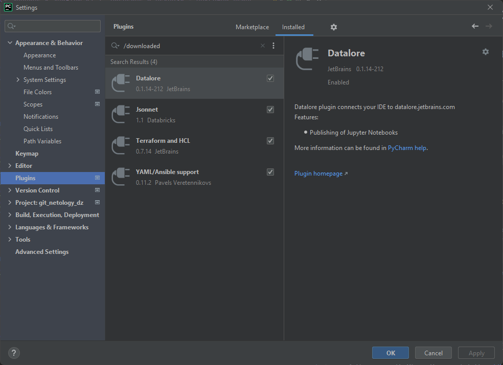
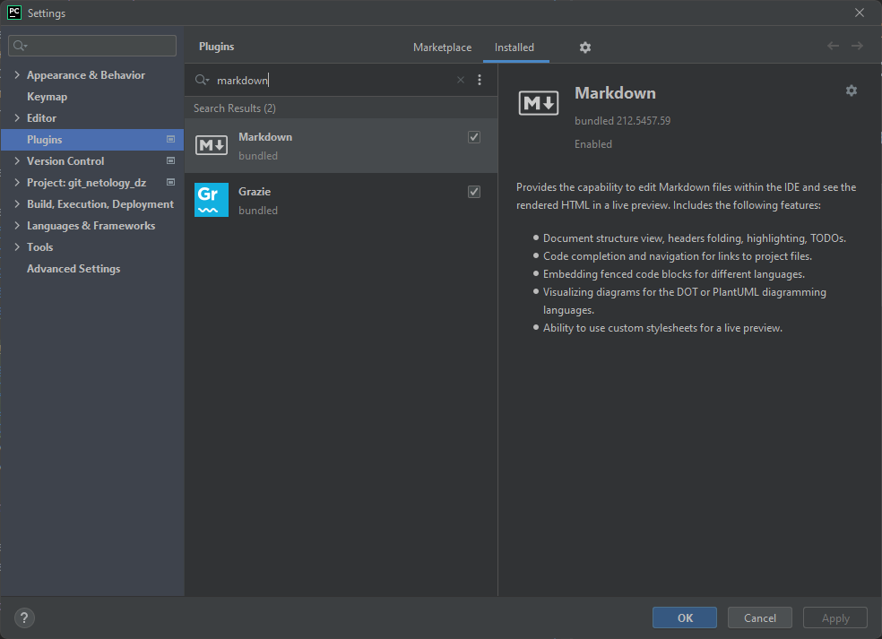
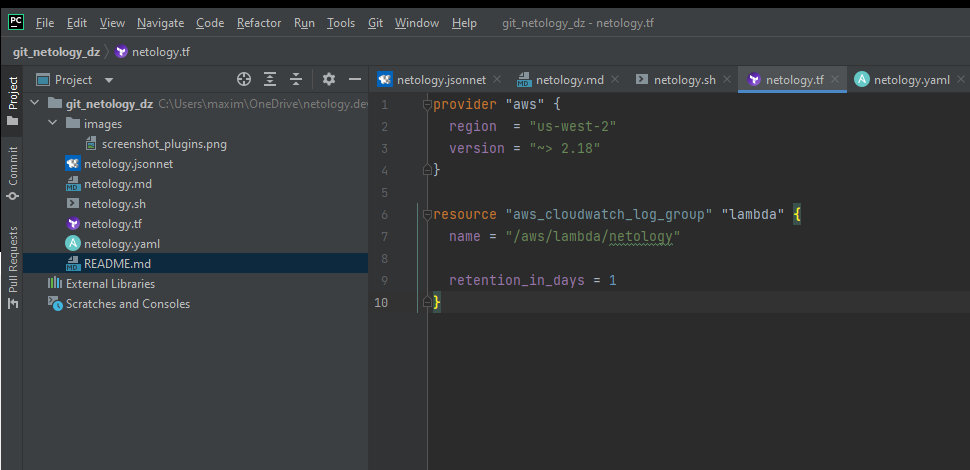
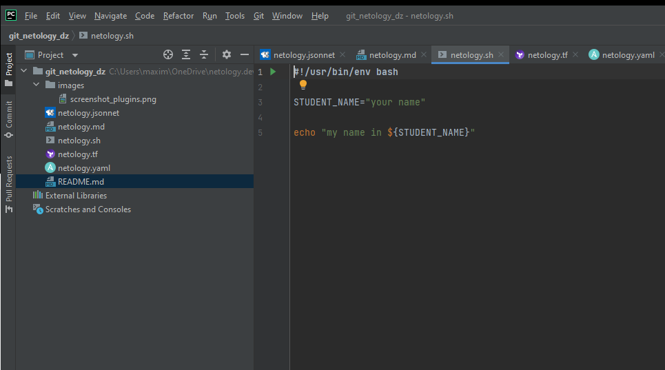
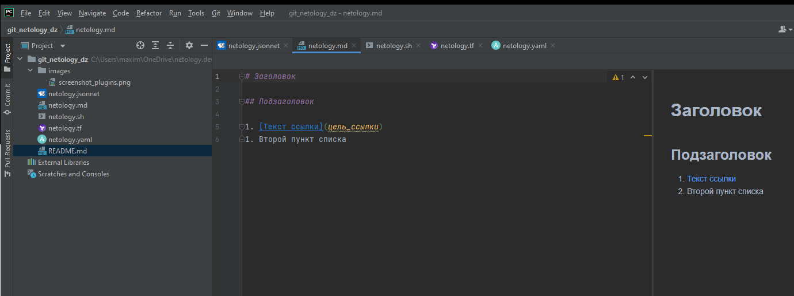
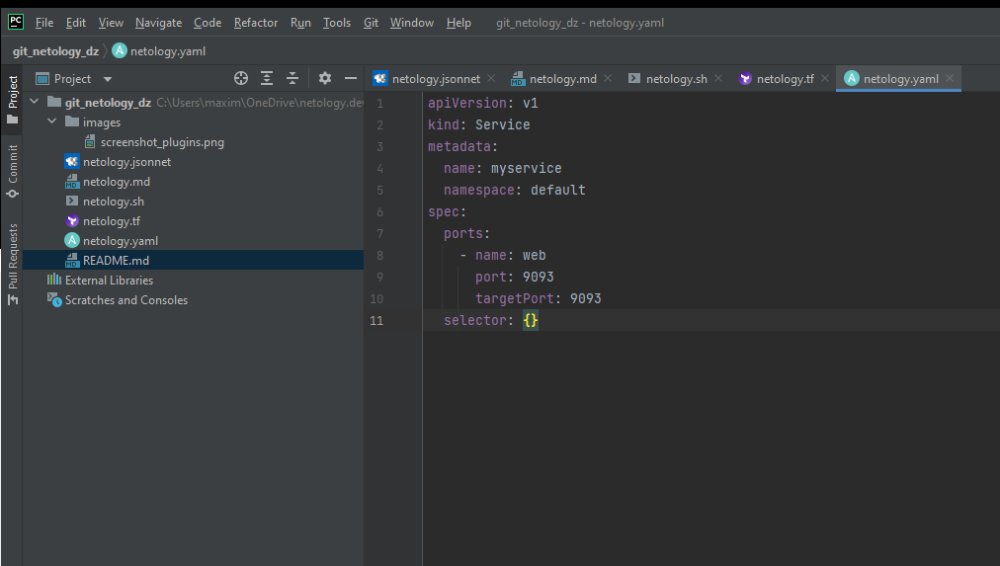
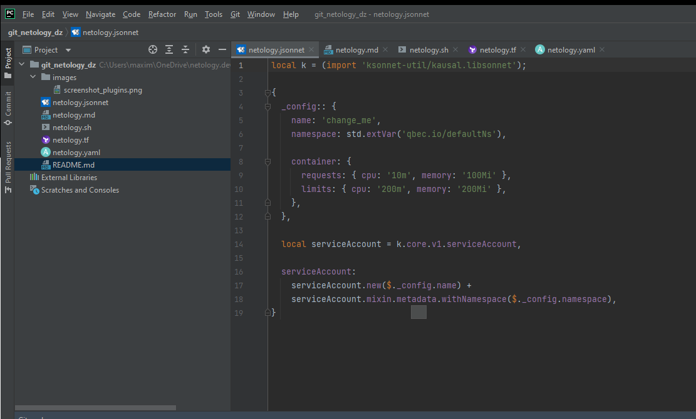

# Домашнее задание к занятию «1.1. Введение в DevOps» - Максимов Денис

## Задание №1 - Подготовка рабочей среды
###1. "Установка PyCharm" и плагинов

Скриншот с установленными плагинами.

Плагин MarkDown уже был активирован.

###2. Проверка подсветки синтаксиса.
Подсветка синтаксиса:
- Terraform: 
- Bash: 
- Markdown: 
- Yaml: 
- Jsonnet: 
